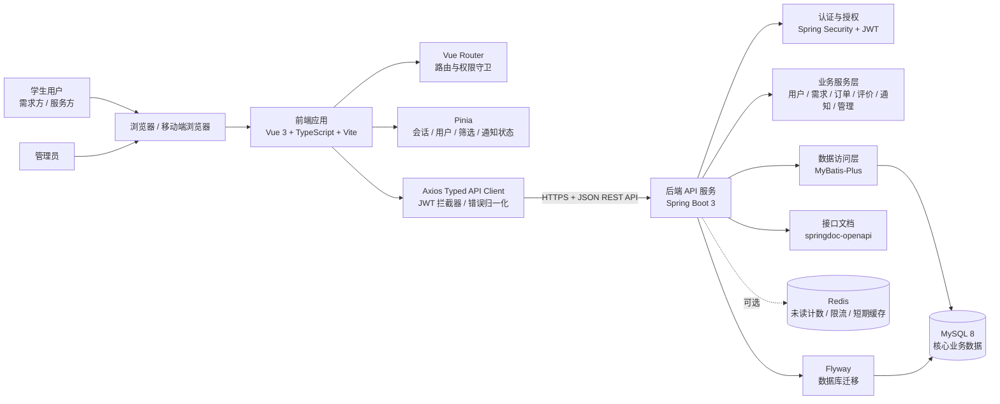
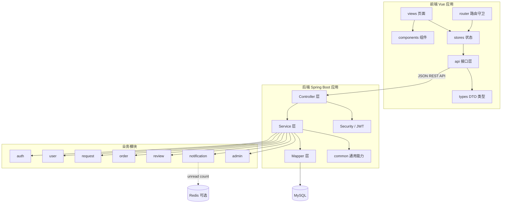

# CampusHub 校园互助服务平台架构设计文档

## 1. 架构概览

### 1.1 架构风格

CampusHub 采用“前后端分离 + 后端分层单体”的体系结构。

前端作为独立的 Vue 单页应用，负责页面展示、路由跳转、表单校验、状态管理和用户交互；后端作为 Spring Boot REST API 服务，负责认证授权、业务规则、订单状态流转、数据访问和接口文档；数据库使用 MySQL 8 保存核心业务数据，Redis 仅作为可选组件，用于未读通知计数、限流或短期缓存等明确场景。

选择该架构的主要原因是：项目周期为 10 周、团队规模为 4 人，核心目标是完成注册登录、需求发布浏览、接单到完成的 P0 闭环。相比微服务架构，分层单体部署和调试成本更低，更容易保证需求、接口、数据库和前端页面之间的可追踪性。

### 1.2 系统架构图

### 1.3 运行与部署视图

开发阶段采用本地分离运行：前端 Vite 开发服务器调用后端 API，后端连接本地或容器化 MySQL。展示和部署阶段建议采用轻量 Docker Compose：前端构建后由 Nginx 提供静态资源，后端以 Spring Boot 应用运行，MySQL 作为独立服务，Redis 默认不启用，除非通知未读计数或限流已经进入实现范围。

## 2. 模块划分说明

### 2.1 前端模块

| 模块 | 职责边界 | 主要依赖 |
|------|----------|----------|
| `router` 路由模块 | 管理登录、首页、需求、订单、通知、管理后台等页面路由；处理登录态和管理员权限守卫。 | Pinia auth store |
| `api` 接口模块 | 封装 Axios 请求，统一附加 JWT，处理错误响应，维护与后端 DTO 对齐的请求/响应类型。 | Axios、`types` |
| `stores` 状态模块 | 管理会话、当前用户、需求筛选条件、通知未读状态等跨页面状态。 | Pinia、`api` |
| `views` 页面模块 | 承载路由级页面，包括登录注册、需求列表、需求详情、发布需求、订单中心、通知、管理后台。 | `components`、`stores`、`api` |
| `components` 组件模块 | 提供可复用表单、状态标签、列表项、确认弹窗、分页和空状态组件。 | Element Plus |
| `types` 类型模块 | 定义前端 DTO、枚举、分页结果、统一响应结构等类型。 | TypeScript |

前端禁止在页面组件中直接散落原始 Axios 调用，所有后端交互都通过 `src/api/` 进入，便于统一维护接口变更、错误提示和 token 处理。

### 2.2 后端模块

| 模块 | 职责边界 | 关键接口或行为 |
|------|----------|----------------|
| `auth` 认证模块 | 用户注册、登录、密码加密、JWT 签发与校验。 | `POST /api/auth/register`、`POST /api/auth/login` |
| `user` 用户模块 | 当前用户资料、角色切换、公开用户摘要、用户状态检查。 | `GET /api/users/me`、`PUT /api/users/me` |
| `request` 需求模块 | 需求发布、列表浏览、筛选、详情、审核状态控制。 | `POST /api/requests`、`GET /api/requests`、`GET /api/requests/{id}` |
| `order` 订单模块 | 接单、确认、开始、完成、取消扩展点和订单状态机校验。 | `POST /api/orders/{requestId}/accept`、`POST /api/orders/{id}/confirm`、`POST /api/orders/{id}/start`、`POST /api/orders/{id}/complete` |
| `review` 评价模块 | 双向评分、文字评价、信用分更新。 | `POST /api/orders/{id}/reviews` |
| `notification` 通知模块 | 订单状态变更、接单、评价等站内通知生成与已读处理。 | `GET /api/notifications`、`POST /api/notifications/{id}/read` |
| `admin` 管理模块 | 用户禁用/启用、需求审核、平台统计数据。 | 管理员权限接口 |
| `common` 通用模块 | 统一响应结构、异常处理、分页对象、枚举、审计字段、工具类。 | 被各业务模块复用 |

后端内部采用 Controller、Service、Mapper 分层。Controller 只接收 DTO 并做参数校验；Service 承担业务规则、权限判断和事务边界；Mapper 通过 MyBatis-Plus 访问数据库。持久化实体不直接暴露给前端。

### 2.3 数据模块

| 表 | 说明 | 关键关系 |
|----|------|----------|
| `users` | 用户账号、密码哈希、角色/管理员标识、用户状态。 | 与 `user_profiles` 一对一 |
| `user_profiles` | 昵称、头像、学院、联系方式、信用分。 | 归属一个用户 |
| `help_requests` | 互助需求标题、描述、分类、地点、期望时间、报酬、需求状态、审核状态。 | 发布者为用户 |
| `orders` | 订单与需求、需求方、服务方、状态、流转时间戳。 | 关联一个需求、两个用户 |
| `reviews` | 订单评价、评分、文字评价、评价人和被评价人。 | 一个订单最多双方各一条评价 |
| `notifications` | 站内通知、接收人、类型、内容、已读状态、关联业务对象。 | 归属一个接收用户 |
| `messages` | P2 可选的一对一消息。 | 订单或会话维度扩展 |
| `audit_logs` | P2 可选的管理员审核日志。 | 记录管理员操作 |

核心状态枚举保持三端一致：需求状态为 `OPEN`、`LOCKED`、`DONE`、`CANCELLED`；审核状态为 `PENDING`、`APPROVED`、`REJECTED`；订单状态为 `ACCEPTED`、`CONFIRMED`、`IN_PROGRESS`、`COMPLETED`、`REVIEWED`、`CANCELLED`；用户状态为 `ACTIVE`、`DISABLED`。

### 2.4 模块依赖图

### 2.5 核心业务流

P0 优先实现三个端到端闭环：

1. 注册登录闭环：用户注册账号，后端使用 BCrypt 保存密码哈希，登录成功后签发 JWT，前端保存 token 并通过路由守卫保护登录后页面。
2. 需求发布与浏览闭环：登录用户发布互助需求，需求通过分类、状态、审核状态和时间排序展示，详情页支持服务方查看并接单。
3. 订单状态闭环：服务方接单后订单进入 `ACCEPTED`，需求方确认后进入 `CONFIRMED`，服务开始后进入 `IN_PROGRESS`，双方完成后进入 `COMPLETED`，评价完成后进入 `REVIEWED`。

订单状态流转必须由后端 Service 校验当前状态、当前用户身份、操作者是否为需求方或服务方，以及关联需求状态是否需要同步变化。

## 3. 技术选型说明

| 层次 | 选择 | 选择理由 |
|------|------|----------|
| 架构风格 | 前后端分离 + 后端分层单体 | 满足 10 周课程项目交付，部署和调试成本低；通过模块化包结构保留后续扩展空间。 |
| 前端框架 | Vue 3 + TypeScript + Vite | Vue 3 适合中小型 Web 应用；TypeScript 提升接口类型一致性；Vite 启动快，开发体验好。 |
| 前端路由 | Vue Router | 支持页面路由、登录态守卫和管理员权限守卫。 |
| 前端状态管理 | Pinia | 管理会话、用户资料、需求筛选和通知未读状态，API 简洁，适合 Vue 3。 |
| 前端 UI 组件 | Element Plus | 表单、表格、弹窗、分页、上传和管理后台组件成熟，可减少基础 UI 开发成本。 |
| 前端请求库 | Axios + typed API client | 统一封装 JWT、错误处理和响应类型，避免页面直接依赖后端细节。 |
| 前端图表 | ECharts | 用于 P2 管理后台统计图，如订单量、分类分布和用户活跃数据。 |
| 前端测试 | Vitest + Vue Test Utils | 覆盖 store、API mapper 和有状态分支的组件，保持与 Vite 生态一致。 |
| 后端语言与框架 | Java 17 + Spring Boot 3 | 生态成熟，适合 REST API、认证授权、参数校验、事务和测试；团队资料获取成本低。 |
| Web API | Spring Web | 提供 REST Controller、JSON 序列化、参数绑定和 HTTP 状态码支持。 |
| 认证授权 | Spring Security + JWT | 适合前后端分离；后端保持无状态；可对管理员接口和用户资源做权限控制。 |
| ORM / 数据访问 | MyBatis-Plus | 适合 CRUD 和条件查询，便于控制 SQL 与索引使用，符合课程项目常见技术栈。 |
| 参数校验 | Bean Validation | 在 Controller DTO 边界统一校验标题、分类、地点、时间、评分等输入。 |
| API 文档 | springdoc-openapi | 自动生成 OpenAPI 文档，方便前后端联调和验收展示。 |
| 后端测试 | JUnit 5 + Mockito + Spring Boot Test | 覆盖认证、订单状态机、权限拒绝、请求筛选和评价信用分计算等高风险逻辑。 |
| 主数据库 | MySQL 8 | 关系模型清晰，适合用户、需求、订单、评价、通知等核心数据；团队学习成本低。 |
| 数据库迁移 | Flyway | 保证从空库可重复创建 schema，便于团队协作、测试和答辩环境复现。 |
| 缓存 / 中间件 | Redis，可选 | 仅在未读通知计数、限流、短期验证码或热点缓存确有需要时启用，避免 P0 阶段过度设计。 |
| 部署方式 | Docker Compose + Nginx + Spring Boot + MySQL | 适合课程展示和本地复现；前端静态资源由 Nginx 托管，后端和数据库独立容器运行。 |
| 接口数据格式 | HTTPS + JSON | 浏览器和后端交互简单直接，便于调试、文档生成和自动化测试。 |

### 3.1 选型边界

本项目暂不采用微服务、消息队列、复杂推荐系统或实时 IM 作为 P0 架构基础。推荐算法、管理后台统计、一对一消息属于 P2 扩展点，只有在注册登录、需求发布浏览、订单流转三个核心闭环稳定后再实现。

### 3.2 主要质量属性支撑

| 质量属性 | 架构支撑方式 |
|----------|--------------|
| 可维护性 | 前后端分离，后端按业务模块和 Controller/Service/Mapper 分层，数据库迁移脚本版本化。 |
| 安全性 | BCrypt 密码哈希、JWT 认证、服务层权限校验、DTO 参数校验、MyBatis-Plus 参数化查询。 |
| 可扩展性 | 业务模块边界清晰，通知、推荐、消息和管理统计作为可选模块扩展。 |
| 可测试性 | 业务规则集中在 Service 层，订单状态机和权限判断可通过单元测试与集成测试覆盖。 |
| 可部署性 | 前端静态化、后端单体服务、数据库独立部署，Docker Compose 可复现运行环境。 |
