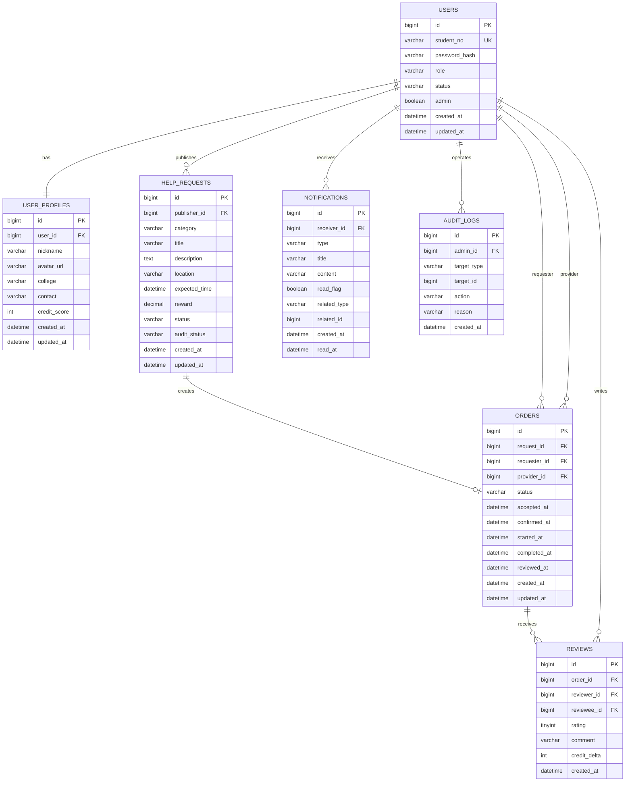

# CampusHub ER 图与建表 SQL

## 1. ER 图



## 2. 关系说明

| 关系 | 说明 |
|------|------|
| `users` 1:1 `user_profiles` | 用户账号与资料拆分，账号表保存认证与状态，资料表保存可展示信息和信用分 |
| `users` 1:N `help_requests` | 一个用户可以发布多个互助需求 |
| `help_requests` 1:0..1 `orders` | P0 阶段一个需求最多存在一个有效订单 |
| `orders` N:1 `users` | 订单同时关联需求方 `requester_id` 和服务方 `provider_id` |
| `orders` 1:0..2 `reviews` | 一个订单最多双方各评价一次 |
| `users` 1:N `notifications` | 通知属于接收用户 |
| `users` 1:N `audit_logs` | 管理员操作写入审计日志 |

## 3. 建表 SQL

以下 SQL 面向 MySQL 8，可作为 Flyway `V1__init_schema.sql` 的核心内容。

```sql
CREATE TABLE users (
    id BIGINT PRIMARY KEY AUTO_INCREMENT,
    student_no VARCHAR(32) NOT NULL,
    password_hash VARCHAR(100) NOT NULL,
    role VARCHAR(32) NOT NULL DEFAULT 'REQUESTER',
    status VARCHAR(32) NOT NULL DEFAULT 'ACTIVE',
    admin BOOLEAN NOT NULL DEFAULT FALSE,
    created_at DATETIME NOT NULL DEFAULT CURRENT_TIMESTAMP,
    updated_at DATETIME NOT NULL DEFAULT CURRENT_TIMESTAMP ON UPDATE CURRENT_TIMESTAMP,
    CONSTRAINT uk_users_student_no UNIQUE (student_no),
    CONSTRAINT ck_users_role CHECK (role IN ('REQUESTER', 'PROVIDER', 'ADMIN')),
    CONSTRAINT ck_users_status CHECK (status IN ('ACTIVE', 'DISABLED'))
) ENGINE=InnoDB DEFAULT CHARSET=utf8mb4 COLLATE=utf8mb4_0900_ai_ci;

CREATE TABLE user_profiles (
    id BIGINT PRIMARY KEY AUTO_INCREMENT,
    user_id BIGINT NOT NULL,
    nickname VARCHAR(30) NOT NULL,
    avatar_url VARCHAR(255) NULL,
    college VARCHAR(80) NULL,
    contact VARCHAR(120) NULL,
    credit_score INT NOT NULL DEFAULT 100,
    created_at DATETIME NOT NULL DEFAULT CURRENT_TIMESTAMP,
    updated_at DATETIME NOT NULL DEFAULT CURRENT_TIMESTAMP ON UPDATE CURRENT_TIMESTAMP,
    CONSTRAINT uk_user_profiles_user_id UNIQUE (user_id),
    CONSTRAINT fk_user_profiles_user FOREIGN KEY (user_id) REFERENCES users(id),
    CONSTRAINT ck_user_profiles_credit CHECK (credit_score >= 0 AND credit_score <= 200)
) ENGINE=InnoDB DEFAULT CHARSET=utf8mb4 COLLATE=utf8mb4_0900_ai_ci;

CREATE TABLE help_requests (
    id BIGINT PRIMARY KEY AUTO_INCREMENT,
    publisher_id BIGINT NOT NULL,
    category VARCHAR(32) NOT NULL,
    title VARCHAR(80) NOT NULL,
    description TEXT NOT NULL,
    location VARCHAR(100) NOT NULL,
    expected_time DATETIME NOT NULL,
    reward DECIMAL(10, 2) NOT NULL DEFAULT 0.00,
    status VARCHAR(32) NOT NULL DEFAULT 'OPEN',
    audit_status VARCHAR(32) NOT NULL DEFAULT 'PENDING',
    created_at DATETIME NOT NULL DEFAULT CURRENT_TIMESTAMP,
    updated_at DATETIME NOT NULL DEFAULT CURRENT_TIMESTAMP ON UPDATE CURRENT_TIMESTAMP,
    CONSTRAINT fk_help_requests_publisher FOREIGN KEY (publisher_id) REFERENCES users(id),
    CONSTRAINT ck_help_requests_category CHECK (category IN ('EXPRESS_PICKUP', 'STUDY_TUTORING', 'SECOND_HAND', 'TEAM_UP', 'OTHER')),
    CONSTRAINT ck_help_requests_status CHECK (status IN ('OPEN', 'LOCKED', 'DONE', 'CANCELLED')),
    CONSTRAINT ck_help_requests_audit CHECK (audit_status IN ('PENDING', 'APPROVED', 'REJECTED')),
    CONSTRAINT ck_help_requests_reward CHECK (reward >= 0)
) ENGINE=InnoDB DEFAULT CHARSET=utf8mb4 COLLATE=utf8mb4_0900_ai_ci;

CREATE TABLE orders (
    id BIGINT PRIMARY KEY AUTO_INCREMENT,
    request_id BIGINT NOT NULL,
    requester_id BIGINT NOT NULL,
    provider_id BIGINT NOT NULL,
    status VARCHAR(32) NOT NULL DEFAULT 'ACCEPTED',
    accepted_at DATETIME NOT NULL DEFAULT CURRENT_TIMESTAMP,
    confirmed_at DATETIME NULL,
    started_at DATETIME NULL,
    completed_at DATETIME NULL,
    reviewed_at DATETIME NULL,
    created_at DATETIME NOT NULL DEFAULT CURRENT_TIMESTAMP,
    updated_at DATETIME NOT NULL DEFAULT CURRENT_TIMESTAMP ON UPDATE CURRENT_TIMESTAMP,
    CONSTRAINT uk_orders_request_id UNIQUE (request_id),
    CONSTRAINT fk_orders_request FOREIGN KEY (request_id) REFERENCES help_requests(id),
    CONSTRAINT fk_orders_requester FOREIGN KEY (requester_id) REFERENCES users(id),
    CONSTRAINT fk_orders_provider FOREIGN KEY (provider_id) REFERENCES users(id),
    CONSTRAINT ck_orders_status CHECK (status IN ('ACCEPTED', 'CONFIRMED', 'IN_PROGRESS', 'COMPLETED', 'REVIEWED', 'CANCELLED')),
    CONSTRAINT ck_orders_different_users CHECK (requester_id <> provider_id)
) ENGINE=InnoDB DEFAULT CHARSET=utf8mb4 COLLATE=utf8mb4_0900_ai_ci;

CREATE TABLE reviews (
    id BIGINT PRIMARY KEY AUTO_INCREMENT,
    order_id BIGINT NOT NULL,
    reviewer_id BIGINT NOT NULL,
    reviewee_id BIGINT NOT NULL,
    rating TINYINT NOT NULL,
    comment VARCHAR(500) NULL,
    credit_delta INT NOT NULL DEFAULT 0,
    created_at DATETIME NOT NULL DEFAULT CURRENT_TIMESTAMP,
    CONSTRAINT fk_reviews_order FOREIGN KEY (order_id) REFERENCES orders(id),
    CONSTRAINT fk_reviews_reviewer FOREIGN KEY (reviewer_id) REFERENCES users(id),
    CONSTRAINT fk_reviews_reviewee FOREIGN KEY (reviewee_id) REFERENCES users(id),
    CONSTRAINT uk_reviews_order_reviewer UNIQUE (order_id, reviewer_id),
    CONSTRAINT ck_reviews_rating CHECK (rating BETWEEN 1 AND 5),
    CONSTRAINT ck_reviews_different_users CHECK (reviewer_id <> reviewee_id)
) ENGINE=InnoDB DEFAULT CHARSET=utf8mb4 COLLATE=utf8mb4_0900_ai_ci;

CREATE TABLE notifications (
    id BIGINT PRIMARY KEY AUTO_INCREMENT,
    receiver_id BIGINT NOT NULL,
    type VARCHAR(40) NOT NULL,
    title VARCHAR(80) NOT NULL,
    content VARCHAR(500) NOT NULL,
    read_flag BOOLEAN NOT NULL DEFAULT FALSE,
    related_type VARCHAR(40) NULL,
    related_id BIGINT NULL,
    created_at DATETIME NOT NULL DEFAULT CURRENT_TIMESTAMP,
    read_at DATETIME NULL,
    CONSTRAINT fk_notifications_receiver FOREIGN KEY (receiver_id) REFERENCES users(id),
    CONSTRAINT ck_notifications_type CHECK (type IN ('ORDER_ACCEPTED', 'ORDER_CONFIRMED', 'ORDER_STARTED', 'ORDER_COMPLETED', 'REVIEW_CREATED', 'AUDIT_RESULT'))
) ENGINE=InnoDB DEFAULT CHARSET=utf8mb4 COLLATE=utf8mb4_0900_ai_ci;

CREATE TABLE audit_logs (
    id BIGINT PRIMARY KEY AUTO_INCREMENT,
    admin_id BIGINT NOT NULL,
    target_type VARCHAR(40) NOT NULL,
    target_id BIGINT NOT NULL,
    action VARCHAR(40) NOT NULL,
    reason VARCHAR(500) NULL,
    created_at DATETIME NOT NULL DEFAULT CURRENT_TIMESTAMP,
    CONSTRAINT fk_audit_logs_admin FOREIGN KEY (admin_id) REFERENCES users(id)
) ENGINE=InnoDB DEFAULT CHARSET=utf8mb4 COLLATE=utf8mb4_0900_ai_ci;
```

## 4. 索引设计

```sql
CREATE INDEX idx_help_requests_category ON help_requests(category);
CREATE INDEX idx_help_requests_status ON help_requests(status);
CREATE INDEX idx_help_requests_audit_status ON help_requests(audit_status);
CREATE INDEX idx_help_requests_expected_time ON help_requests(expected_time);
CREATE INDEX idx_help_requests_created_at ON help_requests(created_at);
CREATE INDEX idx_help_requests_browse ON help_requests(audit_status, status, category, created_at);
CREATE INDEX idx_help_requests_publisher ON help_requests(publisher_id);

CREATE INDEX idx_orders_requester ON orders(requester_id);
CREATE INDEX idx_orders_provider ON orders(provider_id);
CREATE INDEX idx_orders_status ON orders(status);
CREATE INDEX idx_orders_created_at ON orders(created_at);

CREATE INDEX idx_reviews_reviewee ON reviews(reviewee_id);

CREATE INDEX idx_notifications_receiver_read_created
    ON notifications(receiver_id, read_flag, created_at);

CREATE INDEX idx_audit_logs_target ON audit_logs(target_type, target_id);
CREATE INDEX idx_audit_logs_admin ON audit_logs(admin_id);
```

| 索引 | 目的 |
|------|------|
| `uk_users_student_no` | 保证学号唯一，并支持登录查询 |
| `idx_help_requests_browse` | 支持公开需求列表按审核状态、需求状态、分类和时间排序查询 |
| `idx_help_requests_publisher` | 支持“我发布的需求”查询 |
| `uk_orders_request_id` | 保证 P0 阶段一个需求最多一个有效订单 |
| `idx_orders_requester` / `idx_orders_provider` | 支持需求方/服务方订单中心 |
| `uk_reviews_order_reviewer` | 防止同一用户对同一订单重复评价 |
| `idx_notifications_receiver_read_created` | 支持用户通知列表和未读筛选 |

## 5. 隐私与安全处理

- `users.password_hash` 只保存 BCrypt 哈希，不保存明文密码。
- `student_no` 属于登录标识，只在当前用户和管理员场景展示，普通用户公开信息使用 `nickname` 和信用分。
- `user_profiles.contact` 可能包含手机号、邮箱或微信号。P0 阶段建议仅对订单参与方展示；如接入生产环境，应考虑字段级加密或脱敏展示。
- 评价、需求描述等用户生成内容只保存文本，前端展示时必须做 XSS 安全渲染，不允许存储可执行 HTML。

## 6. 数据库设计自查基线

该部分是 AI 生成的数据库设计基线，不替代团队人工审查。

| 检查项 | 当前设计处理 |
|--------|--------------|
| 第三范式 | 用户账号与用户资料拆表；需求、订单、评价、通知各自保存自身事实，未在核心表中重复保存昵称等可变展示字段 |
| 订单唯一性 | `orders.request_id` 唯一约束限制一个需求只能生成一个 P0 有效订单 |
| 评价重复 | `reviews(order_id, reviewer_id)` 唯一约束限制同一用户重复评价 |
| 查询性能 | 对登录、需求浏览、订单中心、通知列表建立索引 |
| 状态一致性 | 状态字段有 CHECK 约束，但状态流转合法性仍需由后端 Service 保障 |
