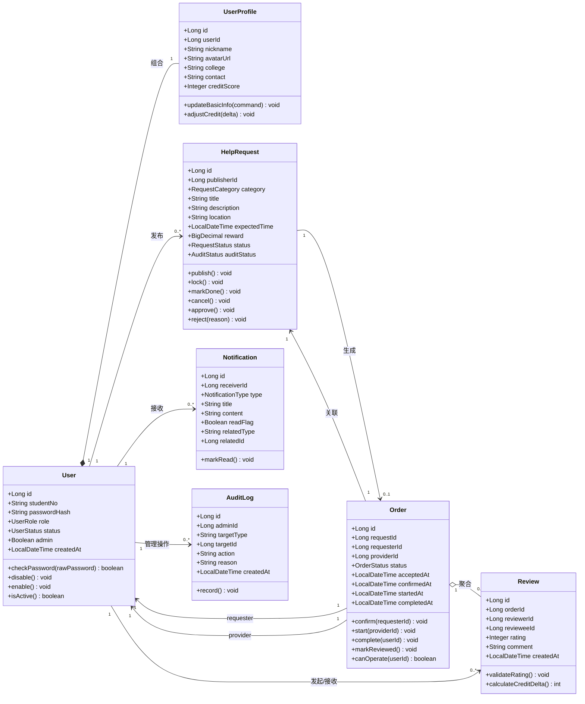
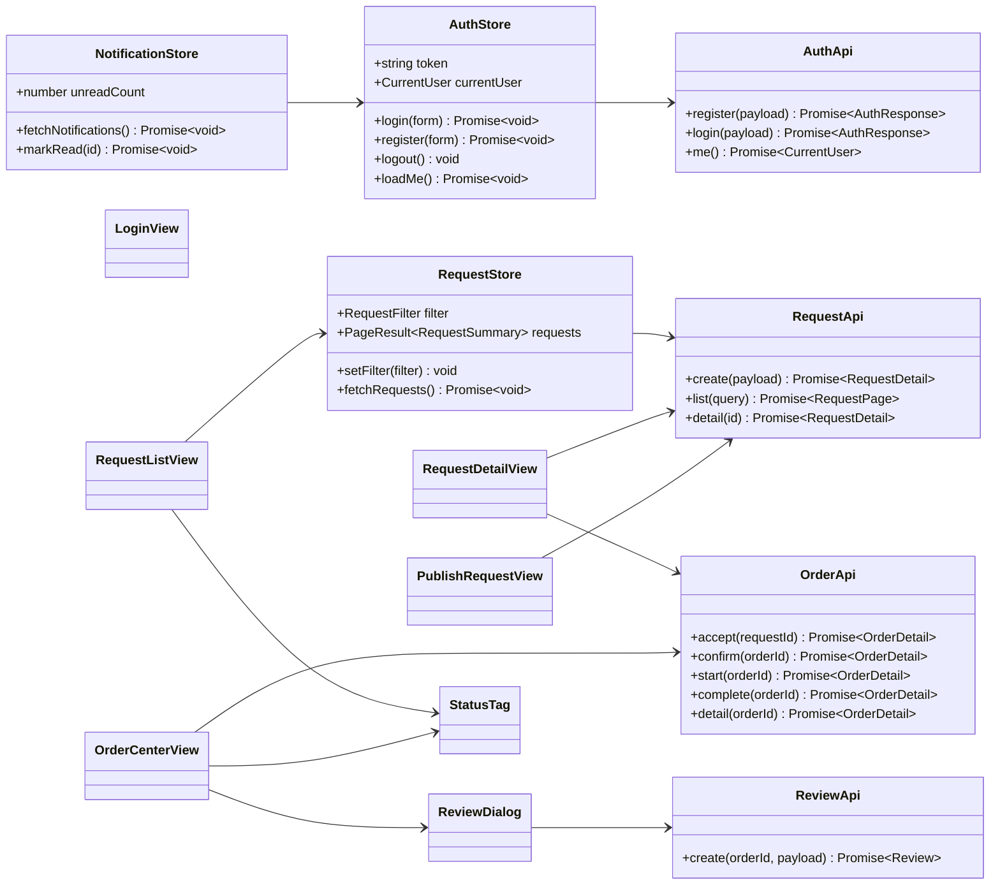

# CampusHub 核心类图

## 1. 设计范围

本类图基于 P2 架构设计中的“前后端分离 + Spring Boot 分层单体”方案，覆盖 P0/P1 核心闭环：

- 用户注册、登录、资料维护与信用分展示
- 需求发布、浏览、筛选、详情查看
- 接单、确认、开始、完成、评价的订单状态流转
- 站内通知与管理员审核扩展点

后端采用 Controller、Service、Mapper 分层。Controller 只处理 HTTP 入参和响应，Service 承担业务规则、权限校验和事务边界，Mapper 负责 MyBatis-Plus 数据访问。实体对象不直接返回给前端，统一通过 DTO 暴露。

## 2. 核心领域类图

## 3. 后端分层类图

> SOLID 修正版：已对 AI 原始类图做以下调整——
> 1. 为所有 Service 和规则对象抽取接口（D/L 修正）；
> 2. `RequestService` 移除 `audit`，新增 `lockRequest`；审核职责移入 `AdminService`（S 修正）；
> 3. `OrderService` 通过 `IRequestService` 修改需求状态，不再直接依赖 `RequestMapper`（D 修正）；
> 4. `NotificationService` 改为 `send(NotificationEvent)` 事件驱动，消除按事件类型硬编码方法（O 修正）；
> 5. `ReviewService` 通过发布 `ReviewCreatedEvent` 解耦 `NotificationService`（D 修正）。

```mermaid
classDiagram
    direction TB

    %% ── Service 接口 ──
    class IAuthService {
        <<interface>>
        +register(RegisterCommand) AuthToken
        +login(LoginCommand) AuthToken
        +loadCurrentUser() CurrentUser
    }
    class IUserService {
        <<interface>>
        +getProfile(CurrentUser) UserProfileDTO
        +updateProfile(UpdateProfileCommand, CurrentUser) UserProfileDTO
    }
    class IRequestService {
        <<interface>>
        +publish(CreateRequestCommand, CurrentUser) RequestDetailDTO
        +query(RequestQuery) PageResult~RequestSummaryDTO~
        +getDetail(Long id) RequestDetailDTO
        +lockRequest(Long id) void
    }
    class IOrderService {
        <<interface>>
        +accept(Long requestId, CurrentUser) OrderDetailDTO
        +confirm(Long orderId, CurrentUser) OrderDetailDTO
        +start(Long orderId, CurrentUser) OrderDetailDTO
        +complete(Long orderId, CurrentUser) OrderDetailDTO
        +getDetail(Long orderId, CurrentUser) OrderDetailDTO
    }
    class IReviewService {
        <<interface>>
        +create(Long orderId, ReviewCommand, CurrentUser) ReviewDTO
    }
    class INotificationService {
        <<interface>>
        +send(NotificationEvent event) void
        +list(CurrentUser, NotificationQuery) PageResult~NotificationDTO~
        +markRead(Long id, CurrentUser) void
    }
    class IAdminService {
        <<interface>>
        +auditRequest(AuditCommand) void
        +disableUser(Long id) void
        +enableUser(Long id) void
    }
    class IOrderStateMachine {
        <<interface>>
        +validateTransition(Order, OrderAction, CurrentUser) void
        +nextStatus(OrderStatus, OrderAction) OrderStatus
    }
    class ICreditPolicy {
        <<interface>>
        +calculateDelta(Integer rating) int
    }

    %% ── 通知事件接口 ──
    class NotificationEvent {
        <<interface>>
        +getType() NotificationType
        +getReceiverId() Long
        +getTitle() String
        +getContent() String
    }

    %% ── Controller ──
    class AuthController {
        +register(RegisterRequest) ApiResponse~AuthResponse~
        +login(LoginRequest) ApiResponse~AuthResponse~
    }
    class UserController {
        +me() ApiResponse~UserProfileDTO~
        +update(UpdateProfileCommand) ApiResponse~UserProfileDTO~
    }
    class RequestController {
        +create(CreateRequestCommand) ApiResponse~RequestDetailDTO~
        +list(RequestQuery) RequestPageResponse
        +detail(Long id) ApiResponse~RequestDetailDTO~
    }
    class OrderController {
        +accept(Long requestId) ApiResponse~OrderDetailDTO~
        +confirm(Long orderId) ApiResponse~OrderDetailDTO~
        +start(Long orderId) ApiResponse~OrderDetailDTO~
        +complete(Long orderId) ApiResponse~OrderDetailDTO~
        +detail(Long orderId) ApiResponse~OrderDetailDTO~
    }
    class ReviewController {
        +create(Long orderId, ReviewCommand) ApiResponse~ReviewDTO~
    }
    class NotificationController {
        +list(NotificationQuery) NotificationPageResponse
        +markRead(Long id) ApiResponse~Void~
    }
    class AdminController {
        +auditRequest(Long id, AuditCommand) ApiResponse~Void~
        +disableUser(Long id) ApiResponse~Void~
        +enableUser(Long id) ApiResponse~Void~
    }

    %% ── Service 实现 ──
    class AuthService {
        +register(RegisterCommand) AuthToken
        +login(LoginCommand) AuthToken
        +loadCurrentUser() CurrentUser
    }
    class UserService {
        +getProfile(CurrentUser) UserProfileDTO
        +updateProfile(UpdateProfileCommand, CurrentUser) UserProfileDTO
    }
    class RequestService {
        +publish(CreateRequestCommand, CurrentUser) RequestDetailDTO
        +query(RequestQuery) PageResult~RequestSummaryDTO~
        +getDetail(Long id) RequestDetailDTO
        +lockRequest(Long id) void
    }
    class OrderService {
        +accept(Long requestId, CurrentUser) OrderDetailDTO
        +confirm(Long orderId, CurrentUser) OrderDetailDTO
        +start(Long orderId, CurrentUser) OrderDetailDTO
        +complete(Long orderId, CurrentUser) OrderDetailDTO
        +getDetail(Long orderId, CurrentUser) OrderDetailDTO
    }
    class ReviewService {
        +create(Long orderId, ReviewCommand, CurrentUser) ReviewDTO
        -updateCredit(Review) void
        -publishReviewCreatedEvent(Review) void
    }
    class NotificationService {
        +send(NotificationEvent event) void
        +list(CurrentUser, NotificationQuery) PageResult~NotificationDTO~
        +markRead(Long id, CurrentUser) void
        -onReviewCreated(ReviewCreatedEvent) void
        -onOrderChanged(OrderChangedEvent) void
    }
    class AdminService {
        +auditRequest(AuditCommand) void
        +disableUser(Long id) void
        +enableUser(Long id) void
    }

    %% ── 规则对象 ──
    class OrderStateMachine {
        +validateTransition(Order, OrderAction, CurrentUser) void
        +nextStatus(OrderStatus, OrderAction) OrderStatus
    }
    class CreditPolicy {
        +calculateDelta(Integer rating) int
    }

    %% ── 事件实现 ──
    class OrderChangedEvent {
        +Order order
        +getType() NotificationType
        +getReceiverId() Long
        +getTitle() String
        +getContent() String
    }
    class ReviewCreatedEvent {
        +Review review
        +getType() NotificationType
        +getReceiverId() Long
        +getTitle() String
        +getContent() String
    }

    %% ── Mapper ──
    class UserMapper
    class UserProfileMapper
    class RequestMapper
    class OrderMapper
    class ReviewMapper
    class NotificationMapper
    class AuditLogMapper

    %% ── Controller → 接口依赖（D 修正） ──
    AuthController         ..> IAuthService
    UserController         ..> IUserService
    RequestController      ..> IRequestService
    OrderController        ..> IOrderService
    ReviewController       ..> IReviewService
    NotificationController ..> INotificationService
    AdminController        ..> IAdminService

    %% ── Service 实现接口（L 修正） ──
    AuthService         ..|> IAuthService
    UserService         ..|> IUserService
    RequestService      ..|> IRequestService
    OrderService        ..|> IOrderService
    ReviewService       ..|> IReviewService
    NotificationService ..|> INotificationService
    AdminService        ..|> IAdminService
    OrderStateMachine   ..|> IOrderStateMachine
    CreditPolicy        ..|> ICreditPolicy

    %% ── 事件继承 ──
    OrderChangedEvent  ..|> NotificationEvent
    ReviewCreatedEvent ..|> NotificationEvent

    %% ── Service → Mapper ──
    AuthService         --> UserMapper
    UserService         --> UserMapper
    UserService         --> UserProfileMapper
    RequestService      --> RequestMapper
    OrderService        --> OrderMapper
    ReviewService       --> ReviewMapper
    ReviewService       --> OrderMapper
    AdminService        --> RequestMapper
    AdminService        --> UserMapper
    AdminService        --> AuditLogMapper
    NotificationService --> NotificationMapper

    %% ── Service → 规则接口（L 修正） ──
    OrderService  --> IOrderStateMachine
    ReviewService --> ICreditPolicy

    %% ── Service 间依赖（S/D 修正） ──
    OrderService  --> IRequestService : lockRequest()
    ReviewService --> NotificationEvent : publish

    %% ── 事件监听 ──
    NotificationService --> NotificationEvent : subscribe
```

## 4. 前端核心类型与组件关系

## 5. 关键枚举

| 枚举 | 值 |
|------|----|
| `UserRole` | `REQUESTER`、`PROVIDER`、`ADMIN` |
| `UserStatus` | `ACTIVE`、`DISABLED` |
| `RequestCategory` | `EXPRESS_PICKUP`、`STUDY_TUTORING`、`SECOND_HAND`、`TEAM_UP`、`OTHER` |
| `RequestStatus` | `OPEN`、`LOCKED`、`DONE`、`CANCELLED` |
| `AuditStatus` | `PENDING`、`APPROVED`、`REJECTED` |
| `OrderStatus` | `ACCEPTED`、`CONFIRMED`、`IN_PROGRESS`、`COMPLETED`、`REVIEWED`、`CANCELLED` |
| `OrderAction` | `ACCEPT`、`CONFIRM`、`START`、`COMPLETE`、`REVIEW`、`CANCEL` |
| `NotificationType` | `ORDER_ACCEPTED`、`ORDER_CONFIRMED`、`ORDER_STARTED`、`ORDER_COMPLETED`、`REVIEW_CREATED`、`AUDIT_RESULT` |

## 6. 设计模式应用

### 6.1 状态模式：订单状态机

订单从 `ACCEPTED` 到 `REVIEWED` 存在严格流转约束，不同动作对操作者身份、当前状态和关联需求状态有不同要求。因此将状态流转集中在 `OrderStateMachine` 中，由 `OrderService` 调用。

SOLID 增强：已抽取 `IOrderStateMachine` 接口，`OrderService` 依赖接口而非具体类。后续扩展（如针对不同需求类型的差异化状态机）只需新增接口实现并通过 Spring DI 注入，符合里氏替换原则（LSP）和依赖倒转原则（DIP）。

使用原因：

- 避免订单状态判断散落在多个 Controller 或 Service 方法中。
- 新增取消、申诉等状态时，可以扩展状态机规则，而不是修改每个业务入口。
- 便于单元测试覆盖非法流转、越权操作和边界条件。
- 通过接口抽象，未来可替换不同状态机实现而不影响 `OrderService`。

如果不用该模式，订单流转条件会分散在接单、确认、开始、完成、评价等方法中，后续新增状态容易遗漏某个入口，导致订单状态不一致。

### 6.2 策略模式：信用分计算策略

评价后的信用分变化由 `CreditPolicy` 计算。P0 阶段可以使用简单评分映射，后续可扩展为按用户等级、历史评价、违规记录等因素计算。

SOLID 增强：已抽取 `ICreditPolicy` 接口，`ReviewService` 依赖接口而非具体类。后续引入不同计分策略（如 `StrictCreditPolicy`、`LenientCreditPolicy`）时通过 `@Qualifier` 注入即可，符合开闭原则（OCP）和里氏替换原则（LSP）。

使用原因：

- 信用分规则属于容易变化的业务规则，独立为策略后不影响 `ReviewService` 主流程。
- 管理员规则调整、风控规则接入时可以替换策略实现。
- 便于测试”不同评分对应不同信用分变化”的纯计算逻辑。
- 通过接口抽象，新增策略类无需修改 `ReviewService`。

如果不用该模式，信用分计算会直接写在评价服务中，后续规则变化会导致评价提交流程频繁修改，增加回归风险。

### 6.3 模板方法：统一分页查询流程

需求列表、订单列表、通知列表都有”接收筛选条件 -> 参数校验 -> 构造查询 -> 转换 DTO -> 返回分页结果”的共同流程。可在应用层沉淀统一分页结果对象和查询模板。

使用原因：

- 保持列表接口响应结构一致。
- 减少分页、排序、空结果处理的重复代码。
- 让业务 Service 只关注自身筛选条件和权限约束。

如果不用该模式，各模块可能返回不同分页字段，前端需要为每个列表写不同适配逻辑。

### 6.4 观察者/事件模式：通知发送解耦

`ReviewService` 完成评价后需要触发通知，但不应直接依赖 `NotificationService`（违反 DIP）。同时 `NotificationService` 原先按事件类型硬编码 `sendOrderChanged` / `sendReviewCreated` 方法，新增通知类型需修改类本身（违反 OCP）。

修正方案：引入 `NotificationEvent` 接口作为抽象事件，`OrderChangedEvent` 和 `ReviewCreatedEvent` 实现该接口。`ReviewService` 只发布事件（`publish`），不感知具体通知实现；`NotificationService` 通过 `send(NotificationEvent)` 统一处理所有事件类型。

使用原因：

- `ReviewService` 与 `NotificationService` 解耦，符合依赖倒转原则（DIP）。
- 新增通知类型只需新增事件类实现 `NotificationEvent` 接口，不修改 `NotificationService`，符合开闭原则（OCP）。
- 未来接入微信推送、邮件通知等新通道时，只需新增监听者，不修改业务 Service。

如果不用该模式，`ReviewService` 直接调用 `NotificationService.sendReviewCreated()`，两个模块强耦合，且每次新增通知类型都需要修改 `NotificationService`。
