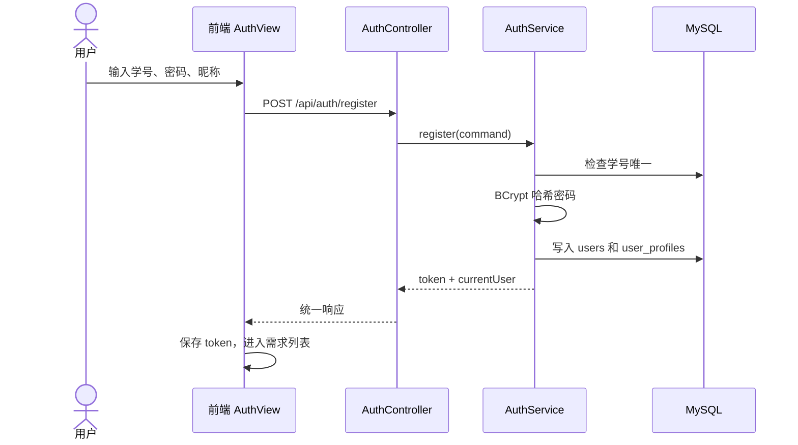
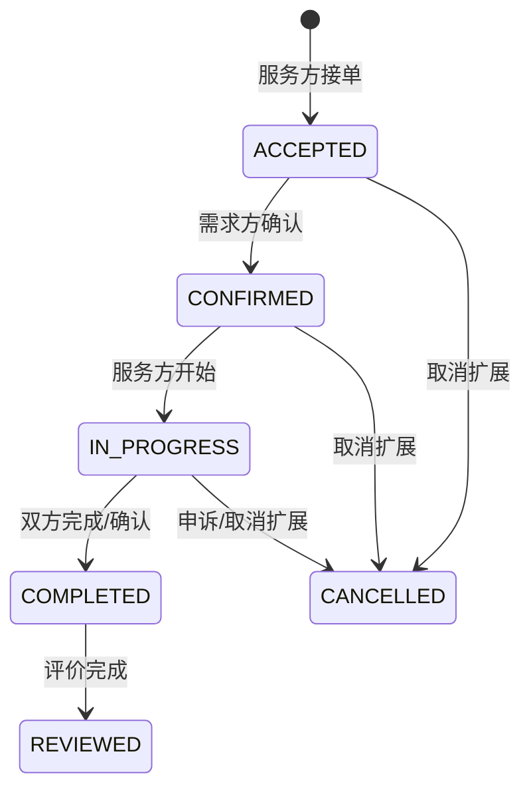
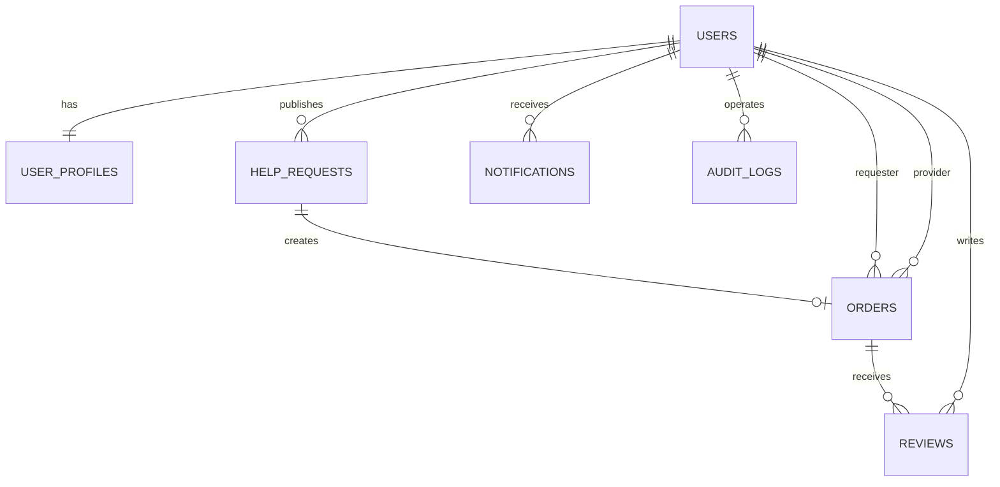

# CampusHub 校园互助服务平台详细设计文档

## 1. 文档目的与范围

本文档是 Phase 3 详细设计整合版，基于 P1 需求规格说明书、P2 架构设计文档和 P3 任务要求编写，面向 CampusHub 校园互助服务平台的核心设计交付。

设计覆盖 P0/P1 核心功能：

- 用户注册、登录、个人资料、信用分
- 互助需求发布、浏览、筛选、详情
- 接单、确认、开始、完成、评价的订单闭环
- 站内通知、管理员审核与用户管理扩展点

## 2. 总体设计约束

| 设计项 | 方案 |
|--------|------|
| 架构风格 | 前后端分离 + 后端分层单体 |
| 前端技术 | Vue 3、TypeScript、Vite、Vue Router、Pinia、Element Plus、Axios |
| 后端技术 | Java 17、Spring Boot 3、Spring Security、JWT、MyBatis-Plus、Bean Validation |
| 数据库 | MySQL 8，Flyway 管理迁移 |
| 可选中间件 | Redis，用于未读通知计数、限流或短期缓存 |
| API 风格 | RESTful + JSON |
| 安全基础 | BCrypt 密码哈希、JWT 认证、服务层权限校验、参数化查询 |

后端采用 Controller → Service 接口 → Service 实现 → Mapper 四层结构。Controller 依赖 Service 接口（`IAuthService`、`IRequestService` 等），不直接依赖具体实现（DIP）；Service 实现负责业务规则和事务；Mapper 负责数据访问。前端通过 `src/api/` 统一封装后端调用，页面组件不直接散落原始 Axios 请求。

## 3. 核心类设计

### 3.1 领域对象

| 类 | 职责 | 关键属性 | 关键方法 |
|----|------|----------|----------|
| `User` | 用户账号、认证状态和角色 | `id`、`studentNo`、`passwordHash`、`role`、`status`、`admin` | `checkPassword()`、`disable()`、`enable()`、`isActive()` |
| `UserProfile` | 用户公开资料和信用分 | `userId`、`nickname`、`avatarUrl`、`college`、`contact`、`creditScore` | `updateBasicInfo()`、`adjustCredit()` |
| `HelpRequest` | 校园互助需求 | `publisherId`、`category`、`title`、`description`、`location`、`expectedTime`、`reward`、`status`、`auditStatus` | `publish()`、`lock()`、`markDone()`、`cancel()`、`approve()`、`reject()` |
| `Order` | 一次互助服务订单 | `requestId`、`requesterId`、`providerId`、`status`、各状态时间戳 | `confirm()`、`start()`、`complete()`、`markReviewed()`、`canOperate()` |
| `Review` | 双方评价与信用分影响 | `orderId`、`reviewerId`、`revieweeId`、`rating`、`comment` | `validateRating()`、`calculateCreditDelta()` |
| `Notification` | 站内通知 | `receiverId`、`type`、`title`、`content`、`readFlag`、`relatedType`、`relatedId` | `markRead()` |
| `AuditLog` | 管理员操作审计 | `adminId`、`targetType`、`targetId`、`action`、`reason` | `record()` |

### 3.2 领域类图

完整类图见 `docs/P3/类图.md` 。

## 4. 服务与分层设计

| 模块 | Controller | Service | Mapper | 职责边界 |
|------|------------|---------|--------|----------|
| 认证 | `AuthController` | `AuthService` | `UserMapper` | 注册、登录、JWT、当前用户加载 |
| 用户 | `UserController` | `UserService` | `UserMapper`、`UserProfileMapper` | 资料查看和修改 |
| 需求 | `RequestController` | `RequestService` | `RequestMapper` | 发布、筛选、详情、需求状态锁定（`lockRequest`） |
| 订单 | `OrderController` | `OrderService` | `OrderMapper` | 接单、确认、开始、完成、订单详情；通过 `IRequestService` 修改需求状态 |
| 评价 | `ReviewController` | `ReviewService` | `ReviewMapper`、`OrderMapper` | 提交评价、信用分更新；通过 `NotificationEvent` 事件发布通知 |
| 通知 | `NotificationController` | `NotificationService` | `NotificationMapper` | 事件监听、通知列表、已读标记；通过 `send(NotificationEvent)` 统一分发 |
| 管理 | `AdminController` | `AdminService` | `RequestMapper`、`UserMapper`、`AuditLogMapper` | 需求审核（从 `RequestService` 移入）、用户禁用/启用、操作审计 |

> **SOLID 修正说明**（对应 `docs/P3/SOLID检查清单.md`）：
> - **S**：`audit` 从 `RequestService` 移入 `AdminService`，`RequestService` 新增 `lockRequest` 作为需求状态锁定的统一入口。
> - **O**：`NotificationService` 改为 `send(NotificationEvent)` 事件驱动，不再按通知类型硬编码方法。
> - **L**：`OrderStateMachine` 和 `CreditPolicy` 分别抽取 `IOrderStateMachine` 和 `ICreditPolicy` 接口。
> - **D**：`OrderService` 通过 `IRequestService` 修改需求状态（不再直接依赖 `RequestMapper`）；`ReviewService` 通过发布 `ReviewCreatedEvent` 解耦 `NotificationService`；Controller 层依赖 Service 接口而非具体类。

## 5. 关键业务流程设计

### 5.1 注册登录

### 5.2 发布与浏览需求

1. 登录用户填写分类、标题、描述、地点、期望时间和报酬。
2. 前端做基础必填和长度校验。
3. 后端 Controller 使用 Bean Validation 校验 DTO。
4. Service 检查用户状态，保存需求，初始状态为 `OPEN`，审核状态为 `PENDING`。
5. 列表查询默认只展示 `auditStatus=APPROVED` 且 `status=OPEN` 的需求。

### 5.3 订单状态流转

状态校验要求：

- 接单时需求必须为 `OPEN` 且审核通过，服务方不能接自己的需求。
- 接单成功后需求状态变为 `LOCKED`。
- 确认接单者只能由需求方执行。
- 开始服务只能由服务方执行。
- 完成订单只能由订单参与方执行，并将需求状态同步为 `DONE`。
- 评价只能在订单 `COMPLETED` 后提交，同一用户对同一订单只能评价一次。

## 6. API 设计摘要

| 功能 | 方法 | URL | 认证 | 说明 |
|------|------|-----|------|------|
| 用户注册 | `POST` | `/api/auth/register` | 否 | 创建账号并返回 JWT |
| 用户登录 | `POST` | `/api/auth/login` | 否 | 校验密码并返回 JWT |
| 当前用户 | `GET` | `/api/users/me` | 是 | 获取当前用户资料 |
| 发布需求 | `POST` | `/api/requests` | 是 | 创建互助需求 |
| 浏览需求 | `GET` | `/api/requests` | 否 | 支持关键词、分类、状态、时间筛选 |
| 需求详情 | `GET` | `/api/requests/{id}` | 否 | 查看公开需求详情 |
| 接单 | `POST` | `/api/orders/{requestId}/accept` | 是 | 服务方接受需求 |
| 确认订单 | `POST` | `/api/orders/{id}/confirm` | 是 | 需求方确认服务方 |
| 开始服务 | `POST` | `/api/orders/{id}/start` | 是 | 服务方开始执行 |
| 完成订单 | `POST` | `/api/orders/{id}/complete` | 是 | 完成订单 |
| 订单详情 | `GET` | `/api/orders/{id}` | 是 | 订单参与方或管理员查看 |
| 提交评价 | `POST` | `/api/orders/{id}/reviews` | 是 | 订单完成后评价对方 |
| 通知列表 | `GET` | `/api/notifications` | 是 | 查询站内通知 |
| 标记已读 | `POST` | `/api/notifications/{id}/read` | 是 | 标记通知已读 |

统一响应结构、请求字段和错误码详见 `docs/P3/API规范文档.md`。

## 7. 数据库设计

### 7.1 核心表

| 表 | 说明 | 关键约束 |
|----|------|----------|
| `users` | 用户账号、密码哈希、角色、状态 | `student_no` 唯一，密码只存 BCrypt 哈希 |
| `user_profiles` | 用户资料、联系方式、信用分 | `user_id` 唯一，信用分范围 0-200 |
| `help_requests` | 互助需求 | 发布者外键，状态和审核状态枚举约束 |
| `orders` | 订单 | `request_id` 唯一，需求方和服务方不能相同 |
| `reviews` | 评价 | `(order_id, reviewer_id)` 唯一，评分 1-5 |
| `notifications` | 站内通知 | 接收人外键，支持已读筛选 |
| `audit_logs` | 管理审计 | 记录管理员对用户/需求等对象的操作 |

### 7.2 ER 图

完整 ER 图、建表 SQL、索引设计和隐私说明见 `docs/P3/ER图+建表SQL.md`。

## 8. 设计模式应用

### 8.1 状态模式

应用位置：`OrderStateMachine`（实现 `IOrderStateMachine` 接口）

订单状态变化具备明确前置状态、动作和操作者限制。将状态规则集中到状态机，能避免状态判断分散在多个接口方法中，并方便测试非法流转。

SOLID 增强：已抽取 `IOrderStateMachine` 接口，使 `OrderService` 依赖接口而非具体类（DIP），未来可替换不同状态机实现（LSP）。

如果不用状态模式，接单、确认、开始、完成、评价等方法会各自写状态判断，后续新增取消或申诉状态时容易遗漏入口。

### 8.2 策略模式

应用位置：`CreditPolicy`（实现 `ICreditPolicy` 接口）

评价后的信用分计算可能随课程项目迭代调整。将信用分计算从 `ReviewService` 中拆出为策略，使评价提交流程和计分规则解耦。

SOLID 增强：已抽取 `ICreditPolicy` 接口，`ReviewService` 依赖接口而非具体类（DIP）。新增计分策略（如 `StrictCreditPolicy`）只需新增接口实现并通过 DI 注入，不修改 `ReviewService`（OCP、LSP）。

如果不用策略模式，信用分规则会写死在评价服务里，后续修改规则会影响评价主流程。

### 8.3 模板方法/统一分页模型

应用位置：需求列表、订单列表、通知列表

分页查询统一使用 `PageResult<T>`，保留一致的 `items`、`page`、`size`、`total`、`pages` 字段。不同业务只实现自身筛选条件。

如果不用统一分页模型，前端需要为每个列表编写不同适配逻辑。

### 8.4 观察者/事件模式

应用位置：`NotificationEvent` 接口及其实现类 `OrderChangedEvent`、`ReviewCreatedEvent`

`ReviewService` 完成评价后发布 `ReviewCreatedEvent`，`NotificationService` 通过 `send(NotificationEvent)` 统一处理所有事件类型。`OrderService` 的订单状态变更同理发布 `OrderChangedEvent`。

SOLID 增强：
- 解耦 `ReviewService` 与 `NotificationService` 的直接依赖（DIP）。
- `NotificationService` 不再按事件类型硬编码方法，新增通知类型只需新增事件类实现 `NotificationEvent` 接口（OCP）。
- 未来接入微信推送、邮件通知等新通知通道时，只需新增监听者订阅事件，不修改业务 Service。

如果不用事件模式，`ReviewService` 直接调用 `NotificationService.sendReviewCreated()`，两个模块强耦合；且每次新增通知类型都要修改 `NotificationService` 类，违反开闭原则。

## 9. 安全与隐私设计

- 密码使用 BCrypt 哈希存储，不保存明文，不在任何 DTO 中返回密码字段。
- 修改类接口全部要求 JWT 认证；管理员接口要求管理员角色。
- Service 层必须做所有权和角色校验，前端按钮隐藏不作为安全依据。
- 用户联系方式只对必要场景展示，普通公开列表使用昵称和信用分。
- 需求描述、评价内容等用户生成文本在前端安全渲染，避免 XSS。
- 数据访问使用 MyBatis-Plus 条件构造或参数化 SQL，避免拼接用户输入。
- 订单状态流转、重复接单、重复评价通过服务层规则和数据库唯一约束共同保障。

## 10. 需求追踪

| 需求 | 设计实现 |
|------|----------|
| FR-1 用户注册 | `POST /api/auth/register`，`users`，`user_profiles` |
| FR-2 用户登录 | `POST /api/auth/login`，Spring Security + JWT |
| FR-3 修改个人信息 | `UserService`，`user_profiles` |
| FR-4 查看信用评分 | `GET /api/users/me`，`credit_score` |
| FR-5 发布互助任务 | `POST /api/requests`，`help_requests` |
| FR-8 浏览任务列表 | `GET /api/requests`，需求筛选索引 |
| FR-9 搜索任务 | `keyword`、`category`、`location` 查询参数 |
| FR-10 申请接单 | `POST /api/orders/{requestId}/accept`，`orders` |
| FR-11 发布者选择接单者 | `POST /api/orders/{id}/confirm` |
| FR-13 查看订单状态 | `GET /api/orders/{id}` |
| FR-14 标记任务完成 | `POST /api/orders/{id}/complete` |
| FR-16 用户评价对方 | `POST /api/orders/{id}/reviews`，`reviews` |
| FR-17 信用评分计算 | `CreditPolicy`，`user_profiles.credit_score` |
| FR-23 系统发送通知 | `NotificationService`，`notifications` |
| FR-25 管理员审核内容 | `/api/admin/requests/{id}/audit`，`audit_logs` |
| FR-26 管理员封禁用户 | `/api/admin/users/{id}/disable`，`users.status` |

